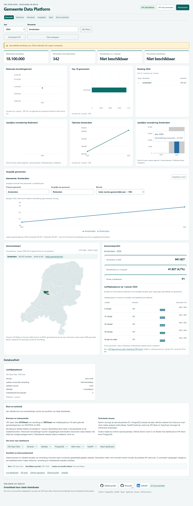
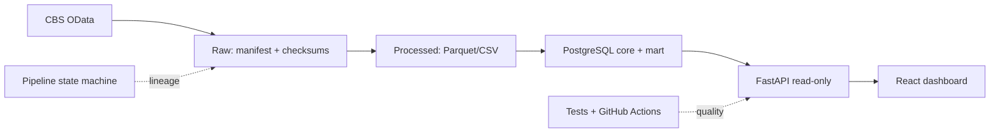

# Gemeente Data Platform

[](https://github.com/salahooo/gemeente-data-platform/actions/workflows/ci.yml)   

Een controleerbaar data-platform voor gemeentelijke bevolkingsinformatie: van officiële CBS OData-records tot een responsive, read-only dashboard. Publieke deployment is in voorbereiding; er is nog geen live URL.



[Dashboard bekijken](docs/dashboard.md) · [API-documentatie](docs/api.md) · [Portfolio-walkthrough](docs/portfolio-walkthrough.md)

## Waarom dit project?

Open overheidsdata is pas bruikbaar wanneer herkomst, kwaliteit en interpretatie zichtbaar blijven. Dit platform haalt CBS OData-data op, valideert en bewaart immutable raw runs, transformeert naar processed Parquet/CSV, laadt PostgreSQL-marts transactioneel en biedt die veilig aan via FastAPI en React.



## Aantoonbare resultaten

| Resultaat | Stand |
| --- | --- |
| Gemeentecodes in dimensie | 360, inclusief historische codes |
| Perioden en feiten | 7 perioden (2020–2026), 2.420 gemeente-jaarfeiten |
| Actieve gemeenten in 2026 | 342 |
| Ontbrekende waarde | Gemiddelde bevolking 2026 blijft `null`, nooit nul |
| Kwaliteit | Python 3.11/3.14, unit-, 5434-integratie- en browser-E2E-tests |

Historische codes blijven voor herleidbare tijdreeksen in de dimensie en zijn niet allemaal actief in 2026. Woonplaatsen zoals Benthuizen en Ter Aar zijn geen zelfstandige gemeenten en hebben daarom geen gemeentecode.

## Technologie

| Onderdeel | Keuze |
| --- | --- |
| Ingestion/transformatie | Python, CBS OData, datacontracten, Parquet/CSV |
| Database | PostgreSQL 17, Alembic, `core`/`mart`/`ops` |
| API/frontend | FastAPI least-privilege, React, TypeScript, Vite |
| Infra/kwaliteit | Docker Compose, Nginx, pytest, Vitest, Playwright, GitHub Actions |
| Architectuur | C4, ERD, lineage, TOGAF-light, ADRs |

## Mijn bijdrage

Dit portfolio-project demonstreert end-to-end data-engineering: Python en SQL, datacontracten en kwaliteitsvalidatie, idempotente transactionele loads, PostgreSQL-modellering, FastAPI-security, React/TypeScript, Docker Compose, unit-/integratie-/E2E-tests en GitHub Actions. De trade-offs staan in de C4-, ERD- en lineageweergaven, TOGAF-light en ADRs.

## Snel starten (Windows PowerShell)

Vereist: Git, Docker Desktop en Python 3.14. Node/npm is alleen nodig voor frontendontwikkeling buiten Docker.

```powershell
git clone https://github.com/salahooo/gemeente-data-platform.git
cd gemeente-data-platform
Copy-Item secrets/postgres_password.txt.example secrets/postgres_password.txt
Copy-Item secrets/app_password.txt.example secrets/app_password.txt
Copy-Item secrets/api_password.txt.example secrets/api_password.txt
# Vul ieder lokaal secretbestand met een eigen sterk wachtwoord; commit ze nooit.
docker compose --profile dashboard up -d --build
Start-Process http://localhost:3000
Start-Process http://localhost:8000/docs
```

Stop zonder volumes te verwijderen: `docker compose --profile dashboard stop dashboard api` en `docker compose stop postgres`. Voor losse ontwikkeling: start PostgreSQL/API zoals hierboven en voer in `frontend/` `npm ci; npm run dev` uit. Alleen voor nieuwe brondata is `py -3.14 -m gemeente_data_platform.run_pipeline` nodig.

## Documentatie

- [Architectuur en C4](docs/architecture.md) · [databaseontwerp/ERD](docs/database-design.md)
- [Raw contract](docs/data-contract.md) · [processed contract](docs/processed-data-contract.md)
- [API](docs/api.md) · [dashboard](docs/dashboard.md) · [pipeline operations](docs/pipeline-operations.md)
- [Runbook](docs/runbook.md) · [CI/CD](docs/ci-cd.md) · [Clouddeployment](docs/deployment.md) · [TOGAF-light](docs/togaf-alignment.md)
- [ADR-register](docs/decisions/README.md) · [portfolio-walkthrough](docs/portfolio-walkthrough.md)

## Aanbevolen GitHub-presentatie

Beschrijving: “Traceerbaar CBS gemeentelijk bevolkingsplatform met Python, PostgreSQL, FastAPI en React.” Website: leeg tot fase 9B. Topics: `python`, `fastapi`, `postgresql`, `react`, `typescript`, `docker`, `data-engineering`, `cbs-open-data`, `github-actions`, `data-quality`, `alembic`, `government-data`.
