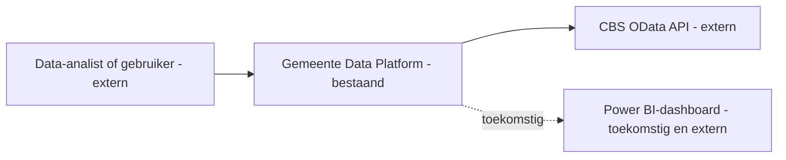
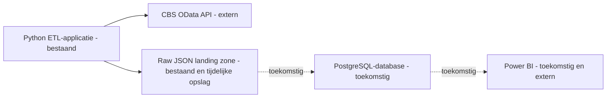
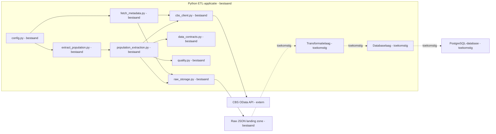
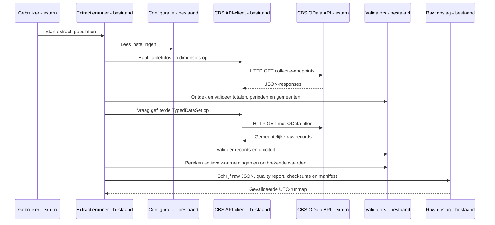

# Architectuur

## Doel en scope

Het Gemeente Data Platform haalt openbare CBS-data gecontroleerd op. In latere
fasen worden gegevens getransformeerd, in PostgreSQL opgeslagen en beschikbaar
gemaakt voor analyse in Power BI.

De huidige implementatie is **fase 2B: dimensieontdekking en raw extractie**.
De applicatie ontdekt en valideert de dimensies van CBS-dataset `03759ned` en
schrijft ongetransformeerde gemeentelijke bevolkingsrecords met manifest naar
een unieke UTC-runmap. Transformatie, PostgreSQL en Power BI zijn toekomstig.

## 1. Systeemcontext

### C4 niveau 1 — Systeemcontext

## 2. Containers

### C4 niveau 2 — Containerdiagram

De bestaande Python-applicatie voert in fase 2B metadata- en dimensieophaling
uit. De raw landing zone bewaart één reproduceerbare run per UTC-run-id.

## 3. Componenten van de Python-applicatie

### C4 niveau 3 — Componentdiagram

## 4. Dynamisch gedrag

### Sequence diagram: volledige extractierun

Een netwerkprobleem, tijdelijke serverfout, HTTP-fout, ongeldige JSON,
paginering buiten de limiet of gebroken datacontract stopt de run met een
duidelijke fout. Er wordt geen gedeeltelijk JSON-bestand gepubliceerd.

### Legenda

- **Bestaand:** geïmplementeerd en getest.
- **Toekomstig:** gepland, nog niet geïmplementeerd.
- **Extern:** systeem buiten onze verantwoordelijkheid.

## Architectuurprincipes

- Verantwoordelijkheden zijn gescheiden tussen configuratie, ophalen,
  validatie en raw opslag.
- Configuratie staat buiten de bedrijfslogica.
- Een herbruikbare CBS-client bundelt headers, timeout, retries en paginering.
- Tests kunnen zonder echte netwerkverbinding worden uitgevoerd.
- Raw CBS-records worden niet hernoemd, geaggregeerd of inhoudelijk
  getransformeerd.
- Atomaire writes, manifesten en checksums maken runs controleerbaar.
- Historische GM-codes blijven raw behouden; activiteit is een afgeleide
  kwaliteitseigenschap op basis van januari-populatie.
- Ontbrekende CBS-waarden zijn niet nul en blijven zichtbaar in kwaliteitsrapportage.
- Secrets en gegenereerde data worden niet gecommit.
- Documentatie verandert mee met de implementatie.
- Een toekomstige component wordt nooit als bestaand gepresenteerd.

## Huidige versus doelarchitectuur

| Onderdeel | Huidig: fase 2B | Later: doelarchitectuur |
| --- | --- | --- |
| Databron | CBS OData API, dataset `03759ned` | CBS-data voor geselecteerde bevolkingsgegevens |
| Ingestie | Dimensieontdekking en OData-filtered raw extractie | Herhaalbare bronextracties voor meerdere datasets |
| Verwerking | Contractvalidatie en afgeleide kwaliteitsrapportage zonder transformatie | Python-transformatielaag en validatieregels |
| Opslag | UTC-runmappen met JSON, quality report, checksums en manifest | PostgreSQL met beheerde tabellen |
| Presentatie | Niet aanwezig | Power BI-dashboard boven op analysegegevens |
| Kwaliteitscontrole | HTTP, JSON, paginering, datacontracten, pytest en Ruff | Aanvullende laad- en rapportagecontroles |
