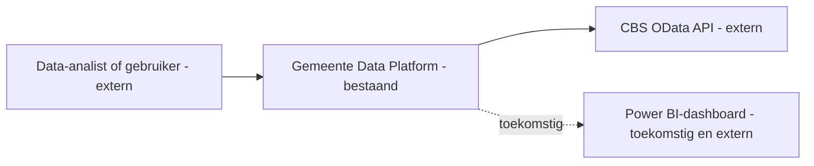
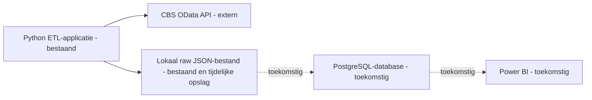
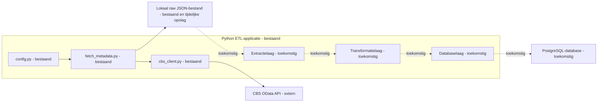
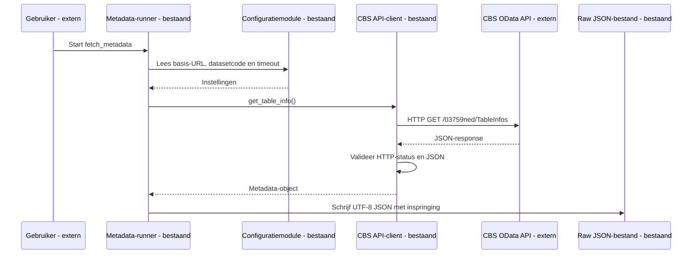

# Architectuur

## Doel en scope

Het Gemeente Data Platform automatiseert het ophalen van openbare CBS-data. In
latere fasen worden gegevens getransformeerd, in PostgreSQL opgeslagen en voor
analyse beschikbaar gemaakt in Power BI.

De huidige implementatie is **fase 2A: metadata-ophaling**. De applicatie haalt
alleen `TableInfos`-metadata op uit CBS-dataset `03759ned` en schrijft die als
UTF-8-JSON naar `data/raw/03759ned_table_info.json`. Er worden nog geen
feitelijke bevolkingsgegevens verwerkt of opgeslagen.

## 1. Systeemcontext

### C4 niveau 1 — Systeemcontext

Het Gemeente Data Platform is hier één systeem. CBS en Power BI zijn externe
systemen; Power BI is bovendien toekomstig.

## 2. Containers

### C4 niveau 2 — Containerdiagram

Dit niveau toont alleen zelfstandig uitvoerbare applicaties of opslaglocaties,
niet de interne Python-modules.

De bestaande Python ETL-applicatie voert in fase 2A alleen metadata-ophaling
uit. Het lokale raw JSON-bestand is tijdelijke opslag; PostgreSQL en Power BI
zijn nog niet geïmplementeerd.

## 3. Componenten van de Python-applicatie

### C4 niveau 3 — Componentdiagram

Dit niveau toont uitsluitend de interne componenten van de Python-applicatie.
De CBS OData API en het lokale raw JSON-bestand staan visueel buiten de
applicatie.

## 4. Dynamisch gedrag

### Sequence diagram: metadata-ophaling

### Legenda

- **Bestaand:** geïmplementeerd en getest.
- **Toekomstig:** gepland, nog niet geïmplementeerd.
- **Extern:** systeem buiten onze verantwoordelijkheid.

Bij een netwerkprobleem, HTTP-fout of ongeldige JSON gooit de CBS API-client
respectievelijk een `CbsNetworkError`, `CbsHttpError` of `CbsInvalidJsonError`.
De runner onderdrukt deze fouten niet; er wordt dan geen geslaagde metadata-run
gemeld.

## Architectuurprincipes

- Verantwoordelijkheden zijn gescheiden tussen configuratie, ophalen en opslag.
- Configuratie staat buiten de bedrijfslogica.
- Een herbruikbare externe API-client bundelt HTTP-afspraken.
- Tests kunnen zonder echte netwerkverbinding worden uitgevoerd.
- Raw data blijft inhoudelijk onveranderd; metadata wordt alleen als JSON
  opgeslagen.
- Secrets en gegenereerde data worden niet gecommit.
- Documentatie verandert mee met de implementatie.
- Een toekomstige component wordt nooit als bestaand gepresenteerd.

## Huidige versus doelarchitectuur

| Onderdeel | Huidig: fase 2A | Later: doelarchitectuur |
| --- | --- | --- |
| Databron | CBS OData API, dataset `03759ned`, endpoint `TableInfos` | CBS-data voor geselecteerde bevolkingsgegevens |
| Ingestie | Python metadata-runner met `requests.Session` | Herhaalbare extractieruns voor brongegevens |
| Verwerking | Geen datatransformatie | Python-transformatielaag en validatieregels |
| Opslag | Lokaal JSON-bestand in `data/raw/` | PostgreSQL met beheerde tabellen |
| Presentatie | Niet aanwezig | Power BI-dashboard boven op analysegegevens |
| Kwaliteitscontrole | HTTP-status, JSON-validatie, pytest en Ruff | Aanvullende data-, laad- en rapportagecontroles |
