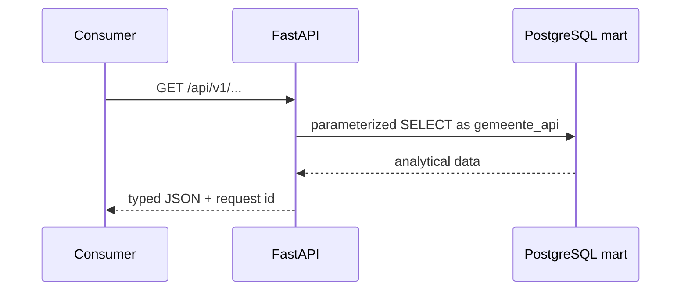
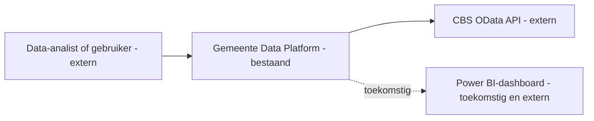
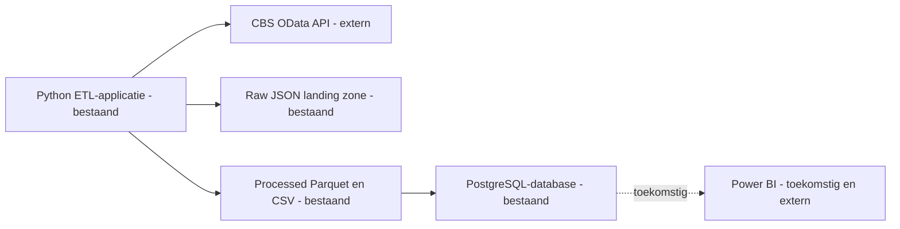
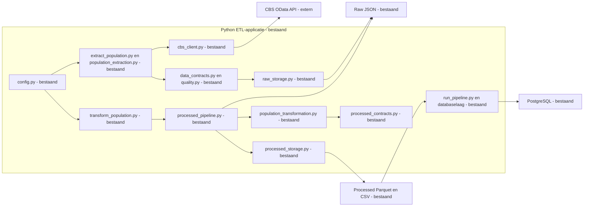
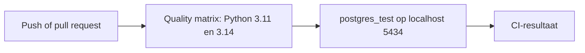
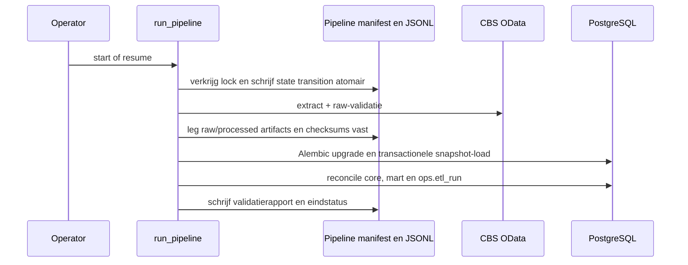
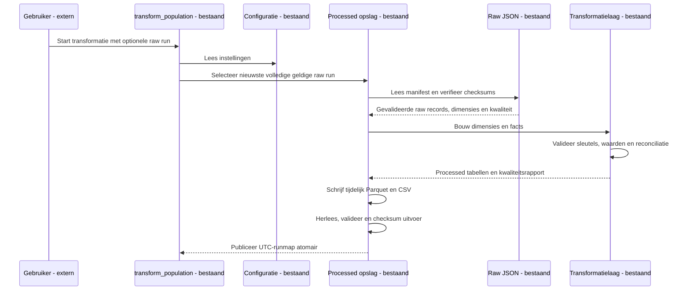
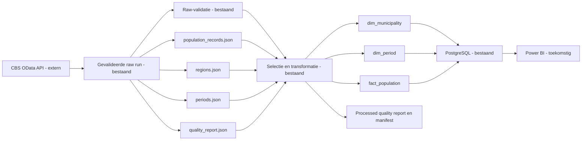
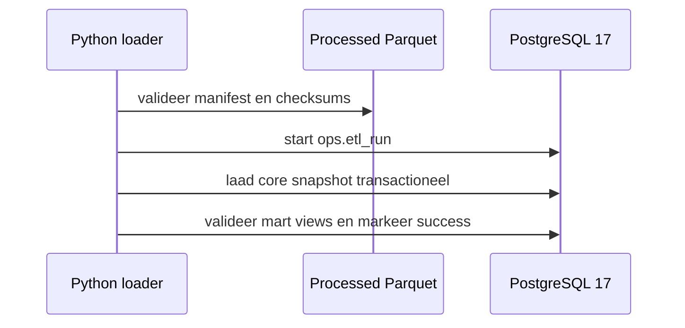
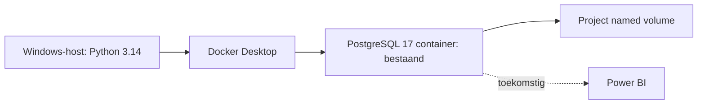

# Architectuur

## Read-only analytics API (fase 7)

FastAPI is een afzonderlijke container boven uitsluitend PostgreSQL `mart`-views.
De service gebruikt `gemeente_api`; `core`, `ops`, raw en processed zijn geen
API-bronnen. Dashboard en Power BI blijven toekomstig.

## Doel en scope

Het Gemeente Data Platform haalt openbare CBS-data gecontroleerd op. Fase 5
bouwt uit een gevalideerde raw run analyseklare bevolkingstabellen en
orkestreert die naar een gevalideerde PostgreSQL-snapshot. Power BI is toekomstig.

## 1. Systeemcontext

### C4 niveau 1 — Systeemcontext

## 2. Containers

### C4 niveau 2 — Containerdiagram

De raw landing zone bewaart een onveranderlijke bronrun per UTC-run-id. De
processed opslag bevat een afzonderlijke, atomair gepubliceerde run met Parquet,
CSV, kwaliteitsrapport en manifest.

## 3. Componenten van de Python-applicatie

### C4 niveau 3 — Componentdiagram

## 4. Dynamisch gedrag

### CI-validatie

De CI-container is een afzonderlijke kwaliteitscomponent. De quality-matrix is
databasevrij; de afhankelijke integratiejob start uitsluitend `postgres_test`
zonder Compose-dependencies. De lokale ontwikkel-PostgreSQL op 5433 is geen
CI-dependency en blijft buiten bereik.

### Sequence diagram: end-to-end pipeline

De cross-platform lock laat per project slechts één schrijvende pipeline toe.
Een resume verifieert geslaagde raw-, processed- en validatie-artifacts voordat
de state machine met de eerste onafgeronde fase verdergaat.

### Sequence diagram: raw naar processed

Een ontbrekende, onvolledige of checksum-onjuiste raw run stopt de verwerking.
Ook contract-, opslag- en uitvoervalidatiefouten stoppen vóór publicatie. De
transformatie doet zelf geen HTTP-aanroep naar CBS.

### Lineage

Het relationele schema staat in het
[processed-datacontract](processed-data-contract.md).

### Legenda

- **Bestaand:** geïmplementeerd en getest.
- **Toekomstig:** gepland, nog niet geïmplementeerd.
- **Extern:** systeem buiten onze verantwoordelijkheid.

## Architectuurprincipes

- Verantwoordelijkheden zijn gescheiden tussen configuratie, extractie,
  transformatie, validatie en opslag.
- Configuratie staat buiten de bedrijfslogica.
- Een herbruikbare CBS-client bundelt transportafspraken voor externe API-calls.
- Tests kunnen zonder echte netwerkverbinding worden uitgevoerd.
- Raw data blijft onveranderd; processed data is herleidbaar naar een raw run.
- Secrets en gegenereerde data worden niet gecommit.
- Documentatie verandert mee met de implementatie.
- Een toekomstige component wordt nooit als bestaand gepresenteerd.

## Huidige versus doelarchitectuur

| Onderdeel | Huidig: fase 5 | Later: doelarchitectuur |
| --- | --- | --- |
| Databron | CBS OData API, dataset `03759ned` | Uitbreidbare CBS-bronnen |
| Ingestie | Gevalideerde raw extractie | Herhaalbare extracties voor meer datasets |
| Verwerking | Raw naar drie processed tabellen | Aanvullende transformaties en regels |
| Opslag | Lokale processed runs en PostgreSQL 17 (`core`, `mart`, `ops`) | Beheerde productieopslag en herstelproces |
| Presentatie | Niet aanwezig | Power BI-dashboard boven analysegegevens |
| Kwaliteitscontrole | Contracten, reconciliatie, checksums, pytest en Ruff | Aanvullende laad- en rapportagecontroles |

## Database-load en deployment

