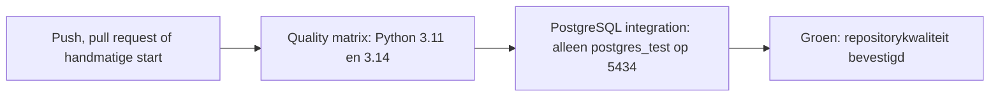

# CI/CD en repositorykwaliteit

De quality-matrix bevat databasevrije FastAPI-contracttests. De geïsoleerde
PostgreSQL-job bouwt het API-image zonder publicatie en test API-privileges
alleen tegen `postgres_test` op 5434.

## Workflow



`.github/workflows/ci.yml` heeft minimale `contents: read`-rechten, annuleert
verouderde runs op dezelfde ref en gebruikt time-outs. De quality-job draait
Ruff, `git diff --check`, dependency-audit en `pytest -m "not integration"`.
Daarom zijn er geen Docker-starts en geen CBS-calls in die job.

De integratiejob start expliciet en zonder dependencies alleen
`docker compose --profile test up --no-deps postgres_test`. Hij maakt tijdelijke
wachtwoordbestanden op de runner, wacht op de Compose-healthcheck en draait met
`RUN_DB_INTEGRATION=1` tegen exact `localhost:5434/gemeente_data_test`.
De bestaande safety guard weigert ieder ander doel. Opruimstappen stoppen en
verwijderen alleen `postgres_test` en de tijdelijke secretbestanden, ook na een
fout. `postgres` op 5433, poort 5432 en het ontwikkelvolume worden nooit door CI
aangeraakt.

Een groene workflow betekent dat de ondersteunde Python-versies databasevrij
slagen en dat migrations, loader, views, rollback en privileges in de geïsoleerde
testdatabase zijn gevalideerd. Een rode workflow betekent dat de falende job en
stap in GitHub Actions de eerste diagnosebron zijn; herhaal vervolgens lokaal de
bijbehorende opdracht hieronder.

De workflow valideert daarnaast `render.yaml`, voert production-configuratietests
uit en bouwt het dashboard met een synthetische HTTPS API-origin. Daarna wordt
de bundle gescand op localhost en credential-achtige waarden. CI deployt nooit
en verbindt nooit met een cloud-database of CBS.

## Lokaal reproduceren

Gebruik PowerShell en Python 3.14 zonder virtual environment:

```powershell
py -3.14 -m pip install --user -e ".[dev]"
py -3.14 -m pytest -m "not integration"
py -3.14 -m ruff check .
git diff --check
docker compose config
docker compose --profile test config
docker compose --profile test up -d postgres_test
$env:RUN_DB_INTEGRATION='1'
py -3.14 -m pytest -m integration
docker compose --profile test stop postgres_test
```

Start nooit `postgres` voor een integratietest. Controleer bij een poortconflict
eerst `docker compose ps`; de testservice moet 5434 gebruiken en de
ontwikkelservice 5433. Bij een mislukte healthcheck is `docker compose logs
postgres_test` veilig om te bekijken, zolang secretinhoud niet wordt gekopieerd.

## Dependencies en supply chain

Dependabot groepeert npm patch- en minorupdates. Major-upgrades worden bewust
als afzonderlijk onderhoudswerk beoordeeld: compatibiliteit, release notes en
groene CI zijn vereist vóór een merge. Deze policy beperkt reguliere version
update-PR's; GitHub Security Advisories blijven een afzonderlijk kanaal en
worden niet door deze ignore-regel uitgeschakeld.

`pyproject.toml` blijft de functionele bron voor runtime- en development
dependencies. `uv.lock` is daarvan de gegenereerde, gecontroleerde resolutie
voor CI op Python 3.11 en 3.14. CI installeert exact die lock met
`uv sync --frozen --all-extras`; de lokale pip-werkwijze blijft ondersteund.
`pip-audit --strict` scant een tijdelijk, door `uv export` gegenereerd overzicht
van de opgeloste externe CI-dependencies zonder credentials. De lokale, niet op
PyPI gepubliceerde editable package staat bewust niet in dat tijdelijke overzicht.

Werk dependencies bij door de relevante constraint in `pyproject.toml` te
wijzigen, `uv lock` uit te voeren, de testmatrix en audit te draaien en de
gegenereerde `uv.lock` samen te reviewen. Werk tegelijk de expliciete
CI-resolverpin `uv==0.9.28` bij wanneer een nieuwe resolver nodig is. Dependabot
maakt gegroepeerde updates voor pip, GitHub Actions en Docker; action-updates
behouden een volledige commit-SHA-pin.
