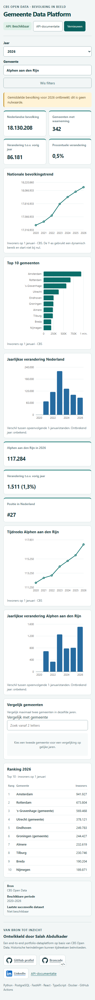

# Gemeentelijk bevolkingsdashboard




De productiecontainer gebruikt een same-origin reverse proxy: alleen `/api/`,
`/ready`, `/health`, `/docs` en `/openapi.json` bereiken de read-only API. De
browser ontvangt geen PostgreSQL-gegevens of credentials. `VITE_API_BASE_URL`
kan voor ontwikkeling een API-basis configureren; Compose gebruikt de lege
same-origin standaard. Fout-, laad- en `null`-meldingen zijn expliciet.

De React/TypeScript-dashboardcontainer leest uitsluitend dezelfde-origin `/api`
via de reverse proxy; de browser kent PostgreSQL noch secrets.

```powershell
cd frontend; npm ci; npm run dev
docker compose --profile dashboard up -d dashboard
```

Open `http://localhost:3000`. Het standaardjaar is het nieuwste API-jaar;
`average_population: null` voor 2026 wordt zichtbaar als ontbrekend, nooit nul.
De interface bevat KPI's, nationale trend, top-10, zoeken, gemeentelijke
tijdreeks en een optionele vergelijking van maximaal twee gemeenten. Na een
selectie toont zij ook de gemeentelijke jaarverandering en nationale rang. De
compacte actualiteitsbalk noemt CBS, de beschikbare periode en de laatste
succesvolle datasetload zonder interne paden, checksums of foutdetails.
Historische herindelingen kunnen trends beïnvloeden. Toekomstig: officiële
versioneerbare gemeentegeometrie en deployment.
