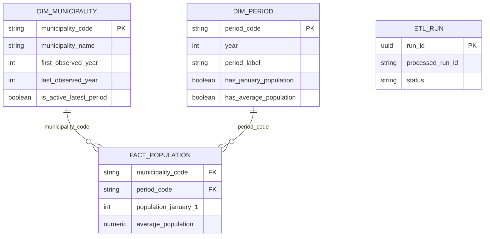

# Databaseontwerp

PostgreSQL 17 bevat de schemas `core`, `mart` en `ops`. Alleen Alembics
technische versietabel staat in `public`.

`INTEGER` past bij gemeentelijke bevolkingswaarden; `NUMERIC(18,3)` bewaart
gemiddelde bevolking. Jaar-op-jaar blijft beperkt tot dezelfde code en is geen
geografische harmonisatie.
