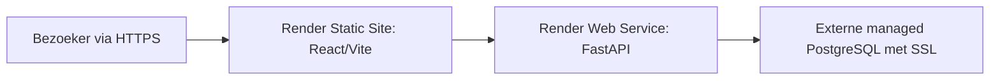

# Publieke clouddeployment (voorbereid, niet actief)

Dit portfolio-project is lokaal voorbereid voor een gratis publieke deployment,
maar heeft geen aangemaakte Render- of databaseaccount, geen live URL en geen
productie-SLA. Controleer actuele prijzen, limieten en voorwaarden vlak voor
activatie; gratis Render-services kunnen cold starts hebben.

`render.yaml` definieert uitsluitend een gratis Static Site en gratis Docker Web
Service op `main`. Er is geen Render Postgres, persistent disk, cronjob of
previewservice. GitHub blijft de source of truth en de SPA-rewrite behoudt routes.

## Handmatige activatie na review

1. Maak Render- en externe PostgreSQL-accounts en controleer actuele prijzen,
   SSL, back-up en sleepbeleid.
2. Maak database en least-privilege rollen bij de provider.
3. Importeer `render.yaml` en vul alleen in Render de geheime variabelen in.
4. Deploy de API, voer databasebootstrap uit, controleer `/health` en `/ready`,
   configureer vervolgens de definitieve dashboard-origin en deploy de Static Site.
5. Vul het GitHub websiteveld pas in na een bewezen deployment en smoke-test.

| Variabele | Service | Betekenis |
| --- | --- | --- |
| `APP_ENV` | API | Moet `production` zijn. |
| `PORT` | API | Providerpoort; Uvicorn luistert op `0.0.0.0`. |
| `DATABASE_URL` | API/bootstrap | Externe PostgreSQL-URL met credentials en `sslmode=require` of strenger. |
| `API_ALLOWED_ORIGINS` | API | Exacte definitieve `https://` dashboard-origin(s). |
| `VITE_API_BASE_URL` | Static Site build | Publieke HTTPS API-origin zonder geheimen. |

`VITE_*`-waarden worden in de browserbundle opgenomen en zijn publiek. Plaats er
nooit wachtwoorden, tokens, database-URL's of interne hostnamen in. De browser
verbindt alleen via HTTPS met FastAPI, nooit rechtstreeks met PostgreSQL.

## Security en operatie

Productie faalt vóór netwerk-I/O bij ontbrekende database-URL, localhost,
ontbrekende PostgreSQL-SSL, wildcard-CORS, HTTP-CORS of ontbrekende credentials.
De API heeft alleen read-only endpoints; er zijn geen shell-, debug- of
write-endpoints. OpenAPI mag publiek blijven. Een webdeploy start nooit
migrations, pipeline of CBS-extractie.

Roteer credentials bij de provider, actualiseer de Render-secret, redeploy en
verifieer `/ready`. Roll back naar een bekende goede revisie en een nieuwe,
gevalideerde snapshot-load. Verwijder services en database handmatig volgens het
providerbeleid, inclusief back-up en credentialrevocatie.
