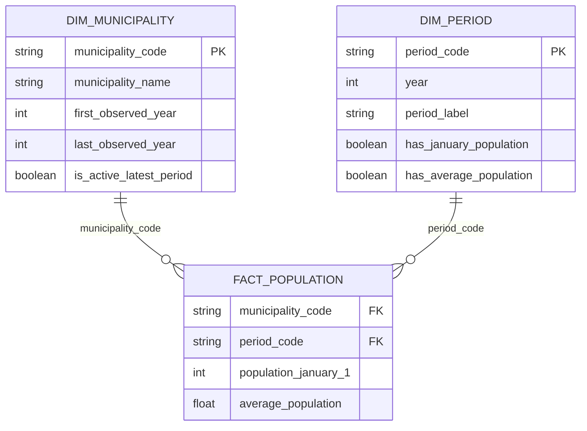

# Processed-datacontract

## Doel en grens

Fase 3 zet een volledig gevalideerde raw run van CBS-dataset `03759ned` om naar
analyseklare tabellen. De transformatie doet geen CBS API-aanroepen en wijzigt
de raw bestanden nooit. De raw landing zone blijft daarmee de onveranderlijke
bron voor een processed run.

Een run wordt gepubliceerd onder
`data/processed/cbs/03759ned/<utc-run-id>/`. Publicatie gebeurt eerst in een
tijdelijke map; pas nadat de uitvoer is herlezen en gecontroleerd wordt de map
atomair gepubliceerd.

## Selectie en modellering

Alleen `GM####`-codes met ten minste één actieve waarneming komen in
`dim_municipality`. Een actieve waarneming heeft een geldige, niet-negatieve,
numerieke `BevolkingOp1Januari_1`. Ontbrekend is dus niet nul. Historische codes
blijven met hun eigen waarnemingsgeschiedenis bestaan: er is geen samenvoeging,
geografische harmonisatie of afleiding van juridische gemeentewijzigingen.

`fact_population` heeft de samengestelde unieke sleutel
`(municipality_code, period_code)`. `average_population` is nullable. De
dimensies bevatten alleen attributen die direct uit de gevalideerde raw
dimensies of waarnemingen kunnen worden afgeleid.

## Bestanden en formaten

| Bestand | Rol |
| --- | --- |
| `dim_municipality.parquet` | Canonieke, getypeerde dimensie-export |
| `dim_municipality.csv` | Leesbare UTF-8-export |
| `dim_period.parquet` | Canonieke, getypeerde dimensie-export |
| `dim_period.csv` | Leesbare UTF-8-export |
| `fact_population.parquet` | Canonieke, getypeerde feitenexport |
| `fact_population.csv` | Leesbare UTF-8-export |
| `quality_report.json` | Statistieken, reconciliation en waarschuwingen |
| `manifest.json` | Herkomst, schema, rijen, datatypen en checksums |

Parquet is de canonieke technische opslag; CSV is een equivalente,
mensleesbare export. Na het schrijven worden de Parquet-bestanden herlezen en
tegen het contract gevalideerd. CSV wordt inhoudelijk met de tabeluitvoer
vergeleken. Checksums dekken alle data- en kwaliteitsbestanden af.

## Herkomst en kwaliteitsregels

`manifest.json` legt onder meer de processed run-id, UTC-tijd, datasetcode en
titel, raw run-id, checksum van het raw manifest, geselecteerde perioden,
transformatieversie, schema's, aantallen, checksums, kwaliteit en waarschuwingen
vast. Paden in het manifest zijn relatief; er staan geen lokale absolute paden
of geheimen in.

Voor elke periode controleert de transformatie de facts tegen het raw
kwaliteitsrapport: aantal actieve records en som van januari-populatie. Ook
controleert zij het aantal ontbrekende gemiddelde-bevolkingswaarden tegen de
geselecteerde raw records. Verder gelden unieke sleutels, GM- en periodepatronen,
geldige bereiken, niet-negatieve januari-populaties en referentiële integriteit.

Waarschuwingen over verschijnende en verdwijnende codes zijn beschrijvend; zij
bewijzen geen oprichting, opheffing of grenswijziging van een gemeente.
